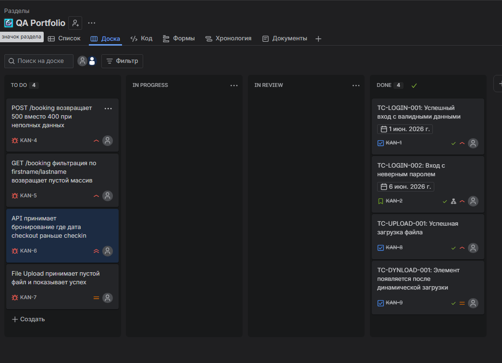
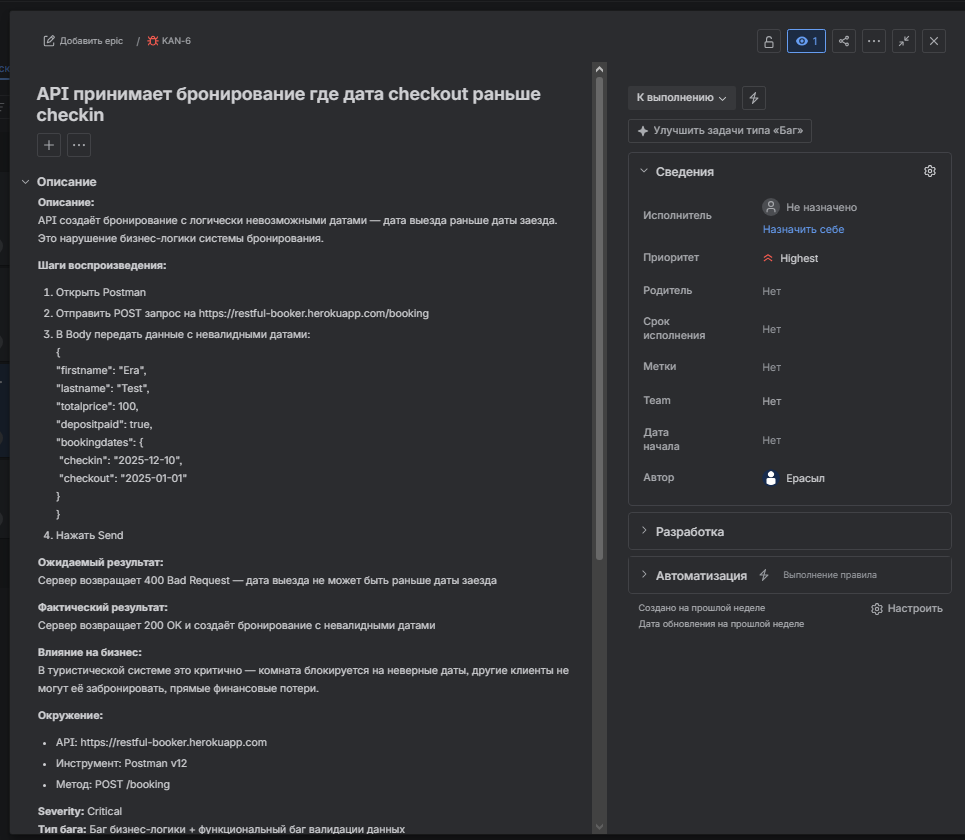
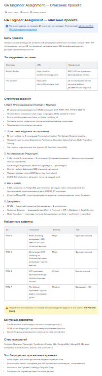

# Скриншоты процесса работы

## Jira — доска проекта с тест-кейсами и баг-репортами

Тест-кейсы (TC-LOGIN, TC-UPLOAD, TC-DYNLOAD) переведены в DONE после успешного прогона. Баги (KAN-4 — KAN-7) ожидают исправления в TO DO.

## Jira — пример баг-репорта

Баг-репорт KAN-6 — критичный дефект бизнес-логики, API принимает бронирование с датой выезда раньше даты заезда.

## Confluence — описание проекта

Общее описание проекта, структура задания, найденные дефекты и стек технологий.